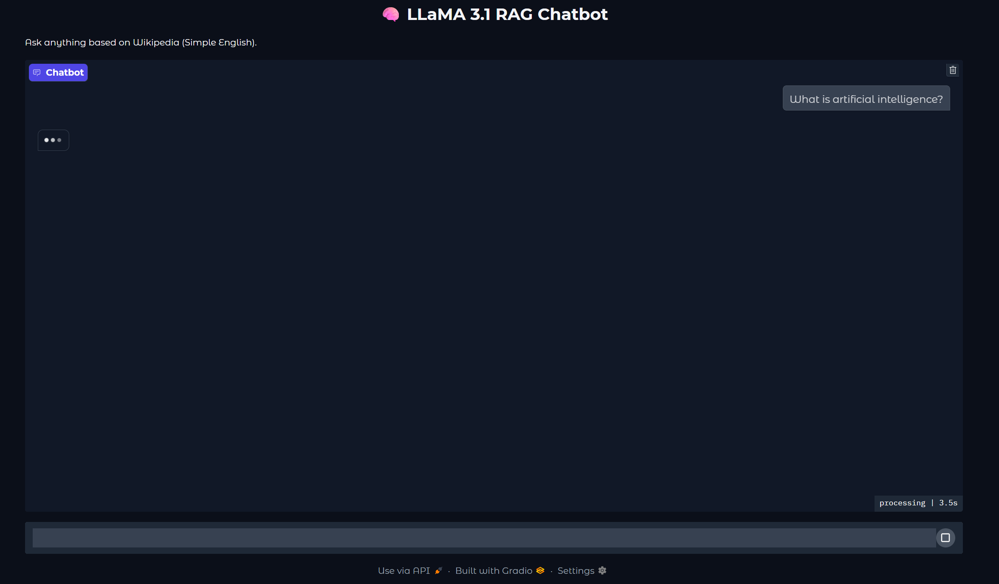
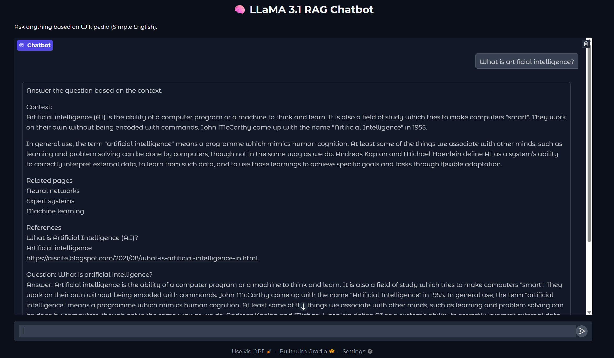

# 🧠 Retrieval-Augmented Generation with LLaMA 3 and Wikipedia

This project demonstrates a complete Retrieval-Augmented Generation (RAG) pipeline using **Meta's LLaMA 3.1** model and **Wikipedia** as the knowledge source. It includes document chunking, embedding generation, vector storage (FAISS), and natural language querying via a simple web interface.

## 🚀 Overview

1. **Load Wikipedia Data**
2. **Split into Chunks**
3. **Generate Embeddings**
4. **Store in FAISS Vector DB**
5. **Run Inference with LLaMA 3.1**
6. **Query via Gradio Interface**

## 🛠 Requirements

- **Python ≥ 3.8**
- **CUDA-enabled GPU**
- **Hugging Face Account** with access to LLaMA 3.1
- Required packages:
  - `datasets`, `sentence-transformers`, `langchain`, `transformers`, `faiss-cpu`, `gradio`, `torch`, `accelerate`

## 🔐 Hugging Face Access Token

To use Meta’s LLaMA 3.1, you must:
1. Accept the model license on [Hugging Face](https://huggingface.co/meta-llama).
2. Run:
   ```bash
   huggingface-cli login
   ```
3. Enter you Hugging Face access token.

## ⚙️ Setup

Install required packages:
```bash
pip install datasets sentence-transformers langchain transformers faiss-cpu gradio torch accelerate
```

## 🧩 Pipeline Code & Explanation

1. **Load & Split Wikipedia**  
   We load the Simple English Wikipedia dataset and split the text into smaller chunks for processing.

2. **Generate Embeddings**  
   Each chunk is embedded into a dense vector using a sentence-transformers model.

3. **Store in FAISS**  
   We build a FAISS vector index to enable fast semantic search over document chunks.

4. **Load LLaMA 3.1**  
   We use transformers to load the LLaMA 3.1 model with quantization (8-bit for GPU efficiency).  
   **Note:** Running LLaMA 3.1 requires a GPU and significant memory (~16GB+ with quantization).

5. **Interface with Gradio**  
   A simple Gradio UI allows users to enter questions and receive LLM-generated answers grounded in Wikipedia content.

## 📷 Screenshot




## 📄 License

This project uses **LLaMA 3.1** under **Meta’s license**.  
Check the [terms of use here](https://huggingface.co/meta-llama).